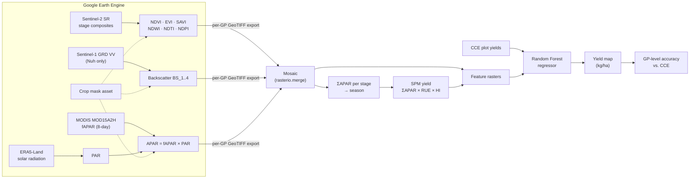

# Methodology

This page explains how the notebooks estimate crop yield. Parameter values for each district are in
[parameters.md](parameters.md).

## Overview

Yield is estimated at 10 m resolution over a crop mask and then summarised per Gram Panchayat (GP).
The approach is a hybrid of two methods:

1. **A light-use-efficiency model (the SPM, or "simple process model").** It turns absorbed
   photosynthetically active radiation (APAR) into a biomass/yield proxy.
2. **A Random Forest regression.** It combines the SPM yield proxy with Sentinel-2 vegetation indices
   and is calibrated against Crop Cutting Experiment (CCE) plot yields.



## 1. Crop season and growth stages

Each season is split into four growth-stage windows, bounded by the dates `g0` to `g4`. Every
satellite-derived variable is composited within these windows, and the stage number becomes the suffix
in the feature name (for example, `NDVI4` means NDVI for stage 4, `g3` to `g4`).

| Crop group | g0 | g1 | g2 | g3 | g4 |
|---|---|---|---|---|---|
| Rabi sorghum (Ahmednagar, Solapur, Belagavi, Vijayapura) | 2022-11-01 | 2022-12-01 | 2022-12-31 | 2023-01-30 | 2023-02-28 |
| Rabi maize (Kamareddy, West Godavari, Thoothukudi, Siddipet) | 2022-12-13 | 2023-01-20 | 2023-01-31 | 2023-03-23 | 2023-05-01 |
| Rabi Bengal gram (Osmanabad) | 2022-11-10 | 2022-11-17 | 2023-01-11 | 2023-01-31 | 2023-03-07 |
| Kharif paddy (Nuh) | 2023-06-15 | 2023-07-10 | 2023-08-19 | 2023-09-13 | 2023-10-13 |

## 2. Crop mask

Every product is masked to crop pixels using a crop-type map uploaded as an Earth Engine asset
(`projects/ee-gaurpushkar8/assets/<District>_...`). The mask's projection is also the reference grid:
all layers are reprojected to it before export.

## 3. Sentinel-2 vegetation indices

For each growth stage and each GP/grid cell, the notebooks take a **mean composite** of
`COPERNICUS/S2_SR_HARMONIZED`, scaled by 0.0001 to reflectance. Six indices are then computed:

| Index | Formula (Sentinel-2 bands) | Sensitive to |
|---|---|---|
| NDVI | (B8 − B4) / (B8 + B4) | Green biomass |
| EVI | 2.5 · (B8 − B4) / (B8 + 6·B4 − 7.5·B2 + 1) | Biomass in dense canopies (less saturation) |
| SAVI | 1.5 · (B8 − B4) / (B8 + B4 + L) | Biomass with soil background correction |
| NDWI | (B8 − B11) / (B8 + B11) | Canopy water content (Gao) |
| NDTI | (B11 − B12) / (B11 + B12) | Crop residue / tillage |
| NDPI | (B8 − (0.74·B4 + 2.6·B11)) / (B8 + 0.74·B4 + 2.6·B11) | Phenology, less affected by soil and snow |

Values are multiplied by 1000 and stored as `int16`. The code uses L = 7.5 for SAVI, where the
standard value is 0.5 (see [known-issues.md](known-issues.md)).

**Nuh (paddy):** paddy is often under cloud cover in the kharif season, so Sentinel-1 is used instead
of Sentinel-2: `COPERNICUS/S1_GRD`, IW mode, descending pass, VV polarisation, averaged per stage
(`BS_1` … `BS_4`).

## 4. APAR

APAR is computed for each MODIS 8-day period:

```
PAR_t   = Σ ERA5-Land surface_solar_radiation_downwards_sum (J m⁻² day⁻¹) × 0.48 / 10⁶     [MJ m⁻²]
fAPAR_t = MOD15A2H Fpar_500m × 0.01
APAR_t  = PAR_t × fAPAR_t
```

- The 0.48 factor converts total shortwave radiation into the photosynthetically active fraction.
- PAR is summed over the days between consecutive MODIS composites.
- fAPAR is reprojected to the crop-mask grid (~10 m), so it is effectively resampled from 500 m.
- Each date is exported per GP as `APAR-<YYYY_MM_DD>-<n>.tif` (×1000, `int16`).

## 5. SPM yield proxy

In `04_yield_modeling/yield_ml_*`:

1. The 8-day APAR rasters are binned into the four growth stages and summed (`Sum_apar_1..4.tif`).
2. The four stage sums are added into a season total (`Sum_apar_5.tif`).
3. Yield proxy = ΣAPAR × RUE × HI, written to `Yield.tif`.

In this step, RUE is radiation use efficiency (g MJ⁻¹) and HI is harvest index. The values in the code
are in [parameters.md](parameters.md).

### Optional stress scalars

The code also contains, mostly commented out, the CASA-style stress scalars, computed from mean
conditions in stage 3 (`g2` to `g3`):

- **Temperature stress**, using ERA5-Land 2 m temperature T (°C):
  `Ts = (T − Tmin)(T − Tmax) / [(T − Tmin)(T − Tmax) − (T − Topt)²]`,
  with Tmin = 5, Topt = 27, Tmax = 33 (34 for maize).
- **Water stress**, using MODIS MOD09A1 NDWI (bands 2 and 6): `Ws = (1 − NDWI) / 1.37`.

`stressFactor()` multiplies these into the stage-3 APAR (`Yield_ts_ws.tif`). They are exported
only in the Bengal gram, maize and rice notebooks. The district RF runs do not use them.

## 6. Random Forest calibration

1. **Training points:** CCE plots, with coordinates (`Longitude`/`Latitude`) and observed yield
   (`Yield (kg_p_ha)`).
2. **Features:** the rasters are sampled at each CCE point with `rasterio.sample`.
   - Sentinel-2 districts use the stage-4 indices plus the SPM yield proxy:
     `EVI4, NDPI4, NDVI4, SAVI4, NDWI4, NDTI4, Yield1`.
   - Nuh uses backscatter plus the SPM yield proxy: `BS_1, BS_2, BS_3, BS_4, Yield`.
3. **Model:** `RandomForestRegressor(n_estimators=1000, criterion="friedman_mse", random_state=123)`.
4. **Prediction:** every raster pixel is flattened into a feature matrix. NoData (the raster minimum)
   is set to 0, the model predicts every pixel, and the result is reshaped to the grid.
5. **Output:** `<District>_<crop>_yield.tif`, in kg/ha, with the background value masked to NaN.

## 7. Accuracy assessment

`05_accuracy_assessment/accuracy_*` works as follows:

1. It samples the predicted yield raster at the CCE points.
2. It spatially joins the points to GP polygons (`gpd.sjoin`, `intersects`).
3. For each GP, it compares observed with predicted values and computes:
   - MAE, MSE, RMSE
   - Pearson r (column `R`)
   - MAPE
   - mean observed and mean predicted yield
4. It keeps the GPs with MAPE below a threshold (50–60 %) and exports them to Excel.

`accuracy_all_districts.ipynb` rolls up the per-district result workbooks and adds:

- a two-sample t-test (predicted vs. observed)
- Willmott's index of agreement

## Limitations

These points affect how the reported accuracy should be read:

- **In-sample fit.** `train_test_split` is called, but the model is fitted on all points
  (`regressor.fit(X, y)`) and then evaluated on those same points. Reported accuracy is therefore
  optimistic.
- **Outlier filtering before metrics.** Points where |predicted − observed| exceeds 500 or 2000 kg/ha
  are dropped before the metrics are computed, and GPs above the MAPE threshold are dropped in the
  final tables.
- **No cloud masking.** Sentinel-2 composites are plain means with no cloud or shadow masking.
- **Resolution mismatch.** fAPAR comes from 500 m MODIS and is resampled to 10 m, so APAR does not
  resolve individual fields.
